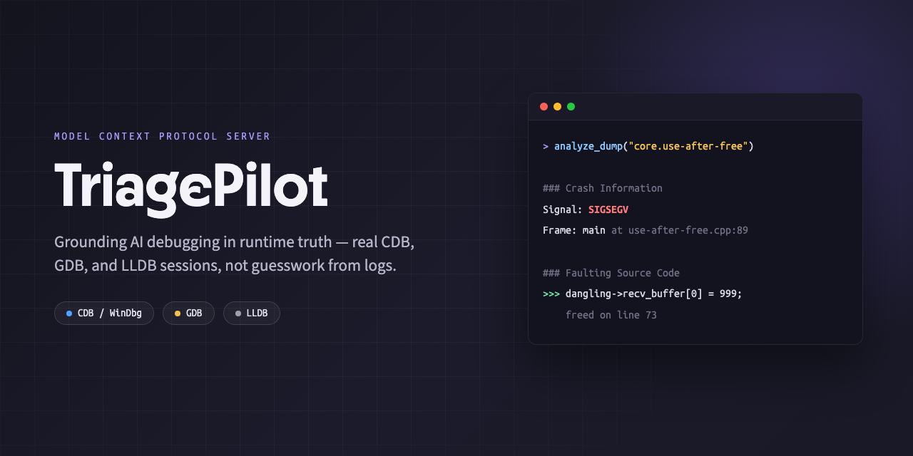
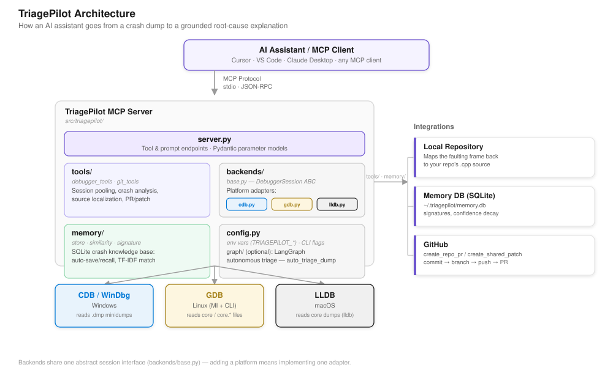
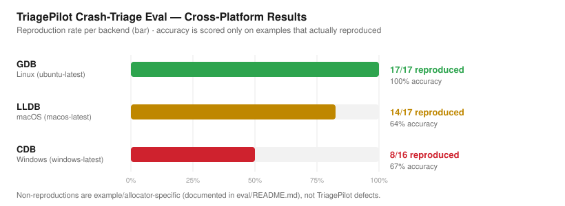

# mcp-agenticdbg (TriagePilot)



[](https://github.com/itsmeakashgoyal/mcp-agenticdbg/actions/workflows/ci.yml)
[](LICENSE)
[](pyproject.toml)
[](https://modelcontextprotocol.io/)

[](#platform-support)
[](#platform-support)
[](#platform-support)
[](https://github.com/itsmeakashgoyal/mcp-agenticdbg/commits/master)
[](https://codespaces.new/itsmeakashgoyal/mcp-agenticdbg)

Grounding AI debugging in runtime truth for crash dumps.

`mcp-agenticdbg` is an [MCP (Model Context Protocol)](https://modelcontextprotocol.io/) server that lets AI assistants triage crashes using real debugger output, not guesswork from logs alone.

Connect it to Cursor, VS Code, or any MCP-compatible client and ask:

- "What caused this crash?"
- "Show the call stack for this dump."
- "Find the faulting source line in my repo."

The assistant drives CDB/GDB/LLDB, extracts crash context, maps it to source, and optionally generates patch/PR artifacts.


*A real crash — [`examples/common/use-after-free.cpp`](examples/common/use-after-free.cpp) — triaged through TriagePilot's actual `analyze_dump` path. More crash types below; see [`docs/demos/`](docs/demos/) to regenerate or add your own.*

Inspired by [`mcp-windbg`](https://github.com/svnscha/mcp-windbg).

## Platform Support

| Platform | Debugger | Dump Types | Status |
|----------|----------|------------|--------|
| Windows  | CDB / WinDbg | `.dmp` (minidump/full dump) | Supported |
| Linux    | GDB | `core`, `core.*`, `*.core` | Supported |
| macOS    | LLDB | core dumps | Supported |

Works with binaries compiled by **MSVC**, **Clang**, **GCC**, or any compiler that produces standard debug information.

## Try It Now (Zero Install)

Click **[Open in GitHub Codespaces](https://codespaces.new/itsmeakashgoyal/mcp-agenticdbg)** — it installs `gdb`, builds the example crash programs, generates a real core dump, and drops you into a shell with TriagePilot ready to run. No local debugger setup required.

```bash
# Once the Codespace is ready:
uv run python eval/run_eval.py --only use-after-free
```

## Quick Start

```bash
# Install (uv — recommended)
uv sync

# Or with pip
pip install -e .

# Verify
triagepilot --help

# Add MCP config (see Configuration below), then ask your assistant:
# "Analyze /path/to/crash.dmp and explain the root cause."
```

## How It Works



1. The AI calls TriagePilot's MCP tools (`analyze_dump`, `run_debugger_cmd`, etc.)
2. TriagePilot auto-detects your platform and launches the right debugger
3. The debugger analyzes the crash dump and returns structured results
4. TriagePilot locates the faulting source in your local repo
5. The AI explains the root cause, suggests fixes, and can create a PR

## Prerequisites

- **Python** `3.10+`
- **Debugger**: CDB/WinDbg (Windows), GDB (Linux), or LLDB (macOS)
- **MCP Client**: [Cursor](https://www.cursor.com/) or [VS Code](https://code.visualstudio.com/)

## Installation

```bash
git clone https://github.com/itsmeakashgoyal/mcp-agenticdbg.git
cd mcp-agenticdbg

# Using uv (recommended — fast, locked dependencies)
uv sync                          # Core deps + dev tools
uv sync --extra langgraph        # Optional: autonomous triage via LangGraph

# Or using pip
python -m venv .venv
source .venv/bin/activate        # Windows: .venv\Scripts\Activate.ps1
pip install -e .
pip install -e ".[langgraph]"    # Optional: LangGraph support
```

## Configuration

### Minimal MCP Config

```json
{
  "mcpServers": {
    "triagepilot": {
      "type": "stdio",
      "command": "python",
      "args": ["-m", "triagepilot"]
    }
  }
}
```

### With Symbols & Repo Path

```json
{
  "mcpServers": {
    "triagepilot": {
      "type": "stdio",
      "command": "python",
      "args": [
        "-m", "triagepilot",
        "--symbols-path", "/path/to/symbols",
        "--repo-path", "/path/to/repo"
      ]
    }
  }
}
```

Config file locations: `.cursor/mcp.json` (Cursor) or `.vscode/mcp.json` (VS Code).

## Available Tools

| Tool | Description |
|------|-------------|
| `analyze_dump` | One-shot crash analysis with stack/modules/threads/source lookup |
| `open_dump` | Open dump and initialize analysis session |
| `run_debugger_cmd` | Execute debugger command on active session |
| `send_ctrl_break` | Interrupt a running debugger command (CTRL+BREAK / SIGINT) |
| `close_dump` | Close active dump session |
| `list_dumps` | Discover dump files from platform-aware paths |
| `create_repo_pr` | Create commit + branch + push + GitHub PR |
| `create_shared_patch` | Generate markdown patch plan for shared/gitignored paths |
| `auto_triage_dump` | Autonomous end-to-end triage (requires `langgraph` extra) |
| `recall_similar_crashes` | Search memory for similar past crash analyses |
| `save_triage_result` | Save root cause and fix to persistent memory |
| `list_known_patterns` | Browse stored crash patterns |
| `forget_pattern` | Delete a memory entry by ID |

## CLI Options

```bash
triagepilot [OPTIONS]
```

| Option | Default | Description |
|--------|---------|-------------|
| `--debugger-type TYPE` | `auto` | Backend: `auto`, `cdb`, `lldb`, `gdb` |
| `--debugger-path PATH` | Auto-detected | Path to debugger executable |
| `--symbols-path PATH` | None | Symbol/debug info path |
| `--image-path PATH` | None | Executable image path |
| `--repo-path PATH` | None | Repository path for source lookup |
| `--timeout SECONDS` | `30` | Debugger command timeout |
| `--verbose` | Off | Enable debug-level logging |
| `--log-level LEVEL` | `INFO` | `DEBUG`, `INFO`, `WARNING`, `ERROR` |

All options are also configurable via environment variables with the `TRIAGEPILOT_` prefix (e.g. `TRIAGEPILOT_DEBUGGER_TYPE=gdb`).

## Example Crash Programs

The `examples/` folder contains seventeen C++ programs that intentionally crash, covering stack overflow, use-after-free, double-free, vtable corruption, heap corruption, format-string bugs, STL iterator invalidation, exception-safety violations, cyclic data structures, unsynchronized concurrent containers, lock-order-inversion deadlocks, dangling stack references across detached threads, and more.

A few, triaged for real — see [`docs/demos/`](docs/demos/) to regenerate or add your own:

<table>
<tr><th>double-free.cpp</th><th>thread-uaf.cpp</th></tr>
<tr>
<td></td>
<td></td>
</tr>
<tr>
<td>Crash location (line 59) vs. root cause (line 46) — the abort backtrace alone doesn't tell you which.</td>
<td>Cross-thread use-after-free — the crashing thread's stack only makes sense next to the thread that freed the memory.</td>
</tr>
</table>

```bash
# Build
cd examples && ./build.sh          # Linux/macOS
cd examples && .\build.ps1         # Windows (MSVC)

# Generate core dump (macOS)
./gen_core_mac.sh use-after-free   # writes build/out/core.use-after-free
```

## Continuous Integration

Every push runs `lint`, `type-check`, and the `pytest` suite across Python
3.10-3.12 on Linux, macOS, and Windows. On top of that, two dedicated jobs
verify the server actually **installs and runs** on all three platforms
using the exact commands from Quick Start above (not the dev/test
environment the other jobs use):

- `verify-install-pip` — `pip install -e .` then a real MCP handshake
  (`initialize` → `list_tools` → `list_prompts`) against the installed
  `triagepilot` console script
- `verify-install-uv` — `uv sync` then the same handshake via `uv run triagepilot`

The handshake itself is `scripts/verify_mcp_server.py`, which uses the
official `mcp` client SDK to spawn the server over stdio and confirm the
core tools (`analyze_dump`, `open_dump`, `run_debugger_cmd`, etc.) and the
triage prompt are actually registered and reachable — not just that the
CLI parses `--help`. No debugger or crash dump is required for this check;
server startup never touches a debugger until a tool call names one.

Run it yourself after installing:

```bash
python scripts/verify_mcp_server.py                              # pip install -e . / plain venv
uv run python scripts/verify_mcp_server.py --command "uv run triagepilot"
```

## Evaluation

`eval/` contains a benchmark that runs every example above through
TriagePilot's real analysis code path and scores the result against known
ground truth (correct signal, correct faulting frame, correct source file).
It measures the deterministic debugger-grounding layer that every other
tool call and the LangGraph LLM reasoning step both depend on.

```bash
uv run python eval/run_eval.py
```

CI runs this on every push against all three backends —
`.github/workflows/ci.yml`'s `eval` (Linux/GDB), `macos-eval` (macOS/LLDB),
and `windows-eval` (Windows/CDB) jobs — and publishes each platform's
results table to its job summary and as a build artifact. Latest results:

| Backend | Platform | Reproduced | Accuracy* |
|---|---|---|---|
| GDB | Linux (`ubuntu-latest`) | 17/17 | 100% |
| LLDB | macOS (`macos-latest`) | 16/16 | 100% |
| CDB | Windows | 16/16 | 100% |

\* Mean of signal/frame/source-location scoring over examples that actually
reproduced a crash; non-reproductions are example- and allocator-specific
(documented per-case, not counted as TriagePilot failures) — see
[`eval/README.md`](eval/README.md) for the full per-example breakdown, root
causes, and known gaps. The Windows row was verified directly against a
real Windows 11 machine (Visual Studio 2022's `cl.exe`, WinDbg's `cdb.exe`)
rather than the `windows-latest` CI job at the time it was last updated —
pending that job's next run to confirm it independently.



See the [Actions tab](../../actions) for the current numbers, and
[`eval/README.md`](eval/README.md) for scope and methodology.

## Troubleshooting

See [docs/TROUBLESHOOTING.md](docs/TROUBLESHOOTING.md) for common issues with debugger setup, core dump generation, symbol resolution, and more.

## Contributing

See [CONTRIBUTING.md](CONTRIBUTING.md) for development setup, code style, testing, and PR guidelines.

## License

BSD 3-Clause License. See [LICENSE](LICENSE) for details.
